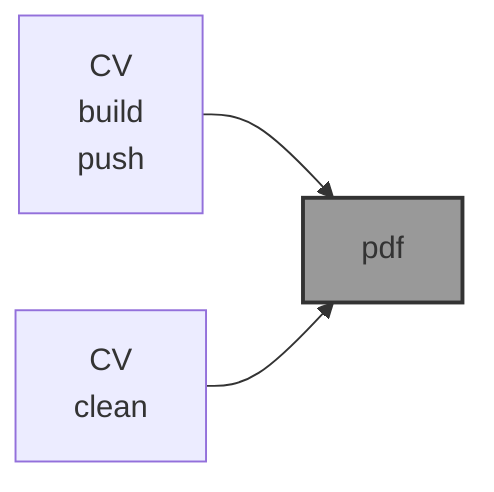

# 📜 CV

📜 `CV` is an [`abcli`](https://github.com/kamangir/awesome-bash-cli) plugin for my CV, in two versions: [compact](./arash-abadpour-resume.pdf) and [full](./arash-abadpour-resume-full.pdf).

```bash
pip install abadpour
```



---

[](https://pypi.org/project/abadpour/)
